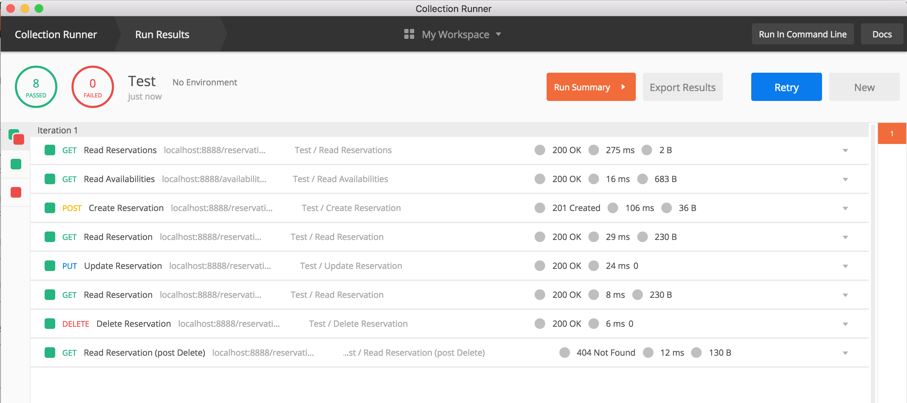

  
# mySpringBootApp  
  
### Design and Implementation decisions 

 - As for sake of fast and simple, I chosen to go with a "monolith" architecture where all services/domains are under the same app/module.  But ideally we could have had multiple service/domains such as: (availabilities, reservations)
 - As a locking mechanism, I decided to choose the option of a secondary table, where the locks would be save, so that on a distributed environments, multiple application instances, every single instance, will be competing the the same lock;

  
### Endpoints  
#### Availabilities  
##### Read availabilities  
``` GET /availabilities```  
Input: from, lower bound date  
Input: to, higher bound date (optional default to a month later than from)  
Output List<AvailabilitiesWS>  
**Example:**  
``` GET /availabilities?from=2018-10-01&to=2018-10-31```  
```  
[  
  {
    "date": "2018-10-01"
  },
  {
    "date": "2018-10-02"
  },
  {
    "date": "2018-10-03"
  }
  :::
  {
    "date": "2018-10-31"
  }
]  
```  
#### Reservations  
##### Create reservation  
``` POST /reservations```  
Input: ReservationWS  
Output: String, reservationUuid  
**Example:**  
Request:  
```  
POST /reservations  
Content-Type: application/json  
  
{  
  "email": "benoit.houle@gmail.com",
  "name": "Benoit Houle",
  "fromDate": "2018-10-05",
  "toDate": "2018-10-07"
}  
```  
Response:  
```  
HTTP 201 CREATED  
Location: /reservations/1d2a2566-f71c-452e-813c-7b3398ca29af  
  
1d2a2566-f71c-452e-813c-7b3398ca29af  
```  
##### Read reservation  
``` GET /reservations/{reservationUuid}```  
Input: reservationUuid  
Output ReservationWS  
**Example:**  
Request:  
```  
GET /reservations/1d2a2566-f71c-452e-813c-7b3398ca29af  
```  
Response:  
```  
HTTP 200 OK  
  
{  
  "createdOn": "2018-09-14 14:25:00",
  "lastModified": "2018-09-14 14:25:00",
  "reservationUuid": "1d2a2566-f71c-452e-813c-7b3398ca29af",
  "email": "benoit.houle@gmail.com",
  "name": "Benoit Houle",
  "fromDate": "2018-10-05",
  "toDate": "2018-10-07"
}  
```  
##### Update reservation  
``` PUT /reservations/{reservationUuid}```  
Input: ReservationWS  
**Example:**  
Request:  
```  
PUT /reservations/1d2a2566-f71c-452e-813c-7b3398ca29af  
Content-Type: application/json  
  
{  
  "fromDate": "2018-10-05",
  "toDate": "2018-10-07"
}  
```  
Response:  
```  
HTTP 200 OK  
```  
##### Cancel reservation  
``` DELETE /reservations/{reservationUuid}```  
Input: String, reservationUuid  
**Example:**  
Request:  
```  
DELETE /reservations/1d2a2566-f71c-452e-813c-7b3398ca29af  
```  
Response:  
```  
HTTP 200 OK  
```

### Testing
#### Smoke
In terms of smoke test, I've created some sort of smoke test suite, which can be import in Postman and executed.

This script is located at the project root: *smokeTest.json*
#### Unit
In terms of unit tests, I've simply tested the reservation controller in order to test the client input business rules;
#### Integration
In terms of integration tests, I've created 2 main test classes
##### ApplicationIT
This particular integration test, will test every single customer facing endpoints, hence the full reservation lifecycle is tested. (Creation, Read, Update, Cancel)
##### ApplicationConcurrentIT
This particular integration test, is only meant to test concurrency with multiple create reservation requests given similar reservation dates.
In order to differentiate the following flows where:
 1. Reservation dates already taken;
 2. Reservation dates are currently processing;

I've made up 2 distinct messages:

 1. The requested reservation dates are already taken.
 2. Unable to obtain reservation lock, the requested reservation dates might already be taken.
 
But from a client perspective the result is the same **409 CONFLICT**

Integration test log example:
```
2018-09-14 14:50:39.943 ERROR 24047 --- [o-auto-1-exec-2] c.ReservationsControllerExceptionHandler : Exception occurred message=Unable to obtain reservation lock, the requested reservation dates might already be taken. (fromDate=2018-09-26, toDate=2018-09-26)
2018-09-14 14:50:39.989 ERROR 24047 --- [       Thread-7] c.h.m.ApplicationConcurrentIT            : Conflict error:ErrorWS(code=409, status=Conflict, details=Unable to obtain reservation lock, the requested reservation dates might already be taken. (fromDate=2018-09-26, toDate=2018-09-26))
```
